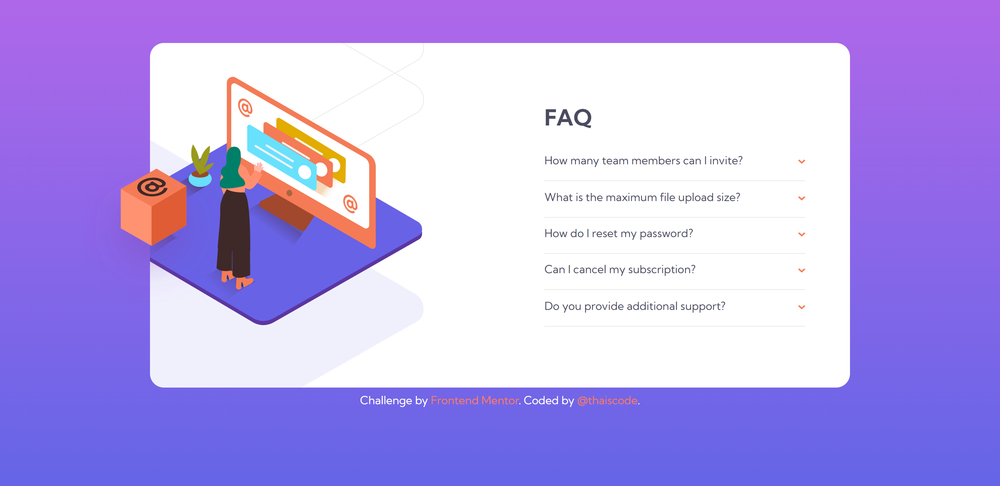
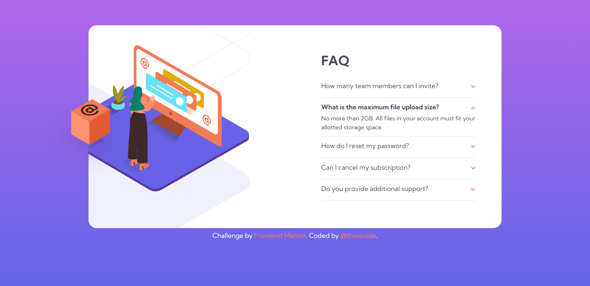
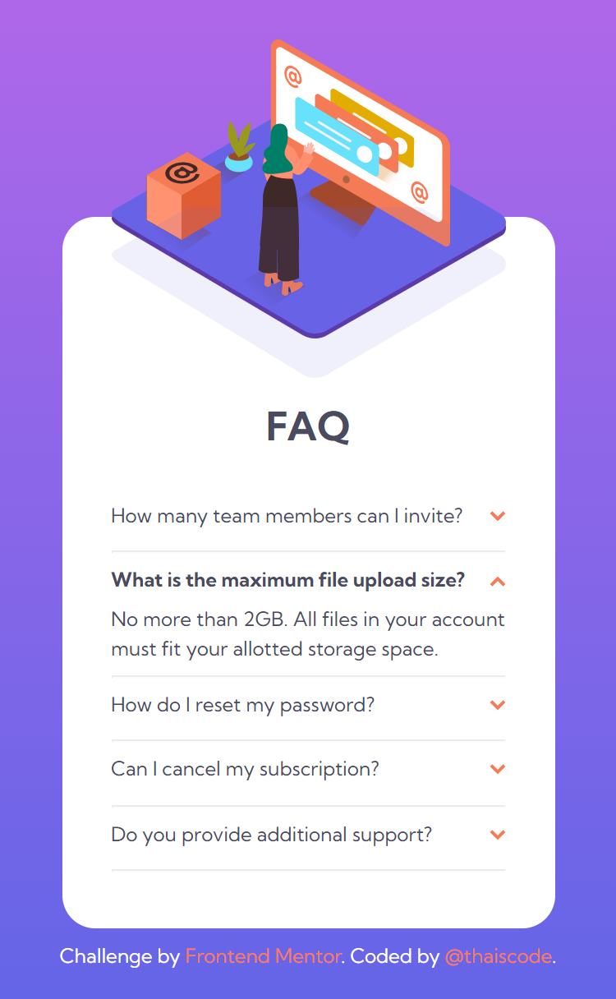

# Frontend Mentor - FAQ accordion card solution

This is a solution to the [FAQ accordion card challenge on Frontend Mentor](https://www.frontendmentor.io/challenges/faq-accordion-card-XlyjD0Oam). Frontend Mentor challenges help you improve your coding skills by building realistic projects. 

## Table of contents

- [Overview](#overview)
  - [The challenge](#the-challenge)
  - [Screenshot](#screenshot)
  - [Links](#links)
- [My process](#my-process)
  - [Built with](#built-with)
  - [What I learned](#what-i-learned)
  - [Continued development](#continued-development)
  - [Useful resources](#useful-resources)
- [Author](#author)

## Overview

### The challenge

Users should be able to:

- View the optimal layout for the component depending on their device's screen size
- See hover states for all interactive elements on the page
- Hide/Show the answer to a question when the question is clicked

### Screenshot

### Links

- Solution URL: [Add solution URL here](https://your-solution-url.com)
- Live Site URL: 

## My process

### Built with

- Semantic HTML5 markup
- CSS custom properties
- Flexbox
- Mobile-first workflow
- JS vanilla
- BEM

### What I learned
From this challenge I learned about a new tag < section>.

I also learned how event.target works in js.

### Continued development

I will continue to focus my studies on vanilla js, to better learn the basics of the language before starting to learn a framework.

### Useful resources

- [MDN](https://developer.mozilla.org) - All my doubts were cleared by MDN.

## Author

- Website - [thaiscode](https://github.com/thaiscode)
- Frontend Mentor - [@thaiscode](https://www.frontendmentor.io/profile/thaiscode)

